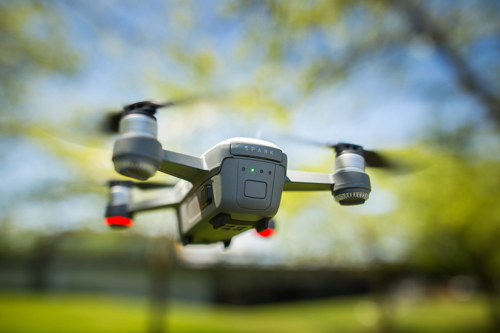

Spark, a mini drone that features all of DJI's signature technologies, allowing you to seize the moment whenever you feel inspired. With intelligent flight control options, a mechanical gimbal, and a camera with incredible image quality, Spark empowers you to push your creative boundaries.

## Specifications
### Aircraft

- Takeoff Weight:	300 g
- Dimensions:	143×143×55 mm
- Diagonal Distance: (propellers excluded)	170 mm
- Max Ascent Speed:	9.8 ft/s (3 m/s) in Sport Mode without wind
- Max Descent Speed:	9.8 ft/s (3 m/s) in Auto Landing Mode
- Max Speed:	31 mph (50 kph) in Sport Mode without wind
- Max Service Ceiling Above Sea Level:	13,123 feet (4,000 m)
- Max Flight Time	16 minutes: (no wind at a consistent 12.4 mph (20 kph))
- Max Hovering Time:	15 minutes (no wind)
- Operating Temperature Range:	32° to 104° F (0° to 40° C)
- Satellite Positioning Systems:	GPS/GLONASS
- Hover Accuracy Range:	Vertical-
    +/- 0.1 m (when Vision Positioning is active) or +/-0.5 m
    Horizontal: 
    +/- 0.3 m (when Vision Positioning is active) or +/-1.5 m
- Transmitter Power (EIRP):	2.4 GHz
    FCC: 25 dBm; CE: 18 dBm; SRRC: 18 dBm; MIC:18 dBm
    5.8 GHz
    FCC: 27 dBm; CE: 14 dBm; SRRC: 27 dBm; MIC: -
    Operating Frequency	2.400 - 2.483 GHz; 5.725 - 5.825 GHz

