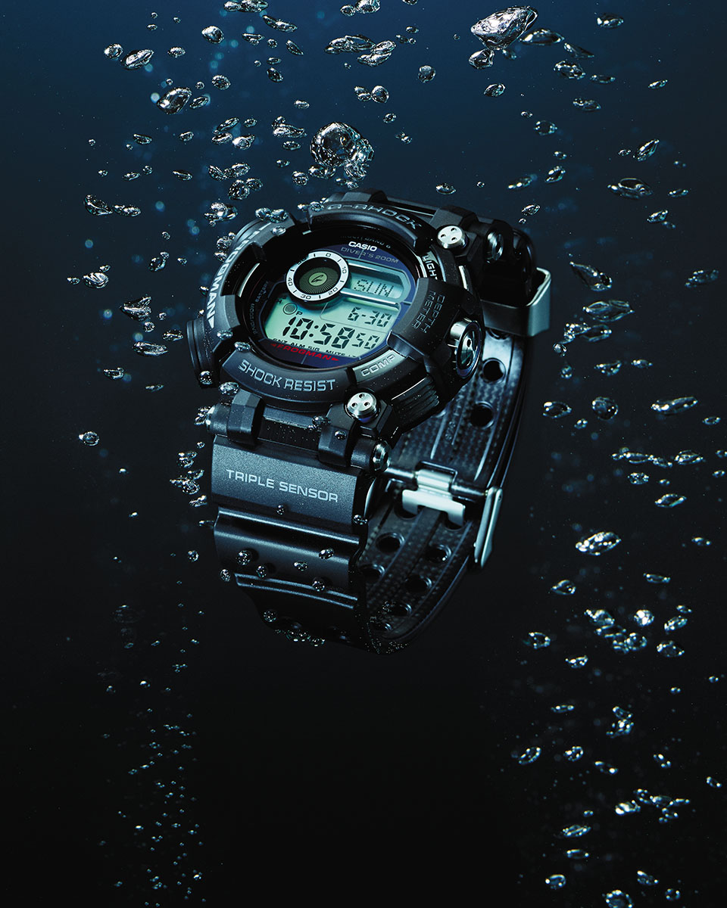

A development project lasting about three years led to the GWF-D1000. Equipped with the first Triple Sensor capable of measuring water depths, this diver’s watch has accomplished astonishing evolution. Its performance provides wide-ranging support for pro divers who undertake arduous underwater missions. Its successful development reflects the developers’ unwavering commitment to the project.

